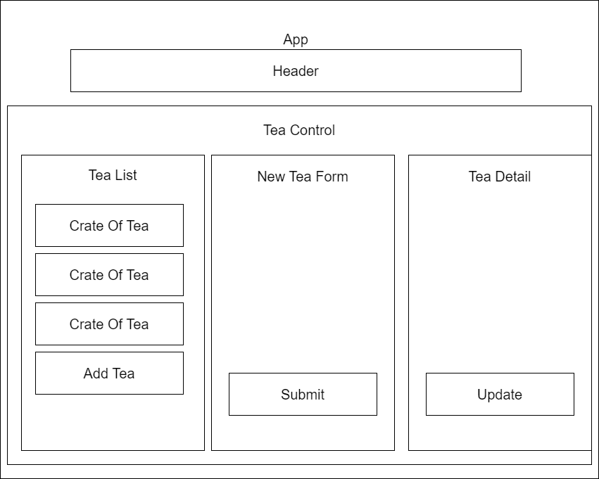

# _Tea-Shop_

#### By _**Will Jolley**_

## Description
Tea-Shop is a web app that allows users to populate a tea shop inventory with 130-oz crates of tea, view and edit details for entries, and update stock to track sales. 

## Technologies Used
- React
- JavaScript
- PropTypes
- NPM
- HTML

## Component Diagram

## Setup/Installation Requirements
1. Clone project `$ git clone https://github.com/WillJolley/tea-shop.git`
2. Navigate to project directory `$ cd tea-shop`
3. Install dependencies `npm install`
4. Start application `npm run start` 

## Known Bugs
- No known bugs. 

**MIT License**

Copyright (c) Will Jolley 2024